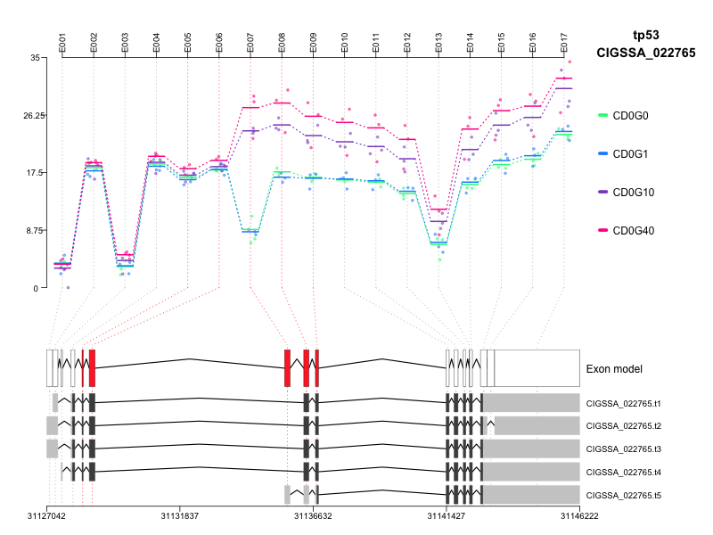

- [DEXSeq<sub>plot</sub>.R](#sec-1)
  - [example](#sec-1-1)
  - [TASKS](#sec-1-2)
    - [Color option for groups](#sec-1-2-1)
- [DB<sub>schema</sub>.R](#sec-2)
- [GOfunctions.R](#sec-3)
- [GOfunctions2.R](#sec-4)
- [circos<sub>script</sub>.R](#sec-5)
- [circos<sub>script2</sub>.R](#sec-6)
- [grid<sub>heatmap</sub>.R](#sec-7)
- [grid<sub>matrix</sub>.R](#sec-8)
- [tile<sub>heatmap</sub>.R](#sec-9)

Collection of usefull `` `R` `` scripts; README has to be improved in time

# DONE DEXSeq<sub>plot</sub>.R<a id="sec-1" name="sec-1"></a>

Script providing extended functionality to plot `` `DEXSeq` `` results.

## example<a id="sec-1-1" name="sec-1-1"></a>

```R
library(DEXSeq)
library(data.table)
source('~/Documents/R_scripts/R/DEXSeq_plot.R')
load( "~/Documents/Cigene/Side_Projects/Radioactive/data/de_exon.RData")

# read gff
gff <- fread('~/Documents/Cigene/Side_Projects/Radioactive/plot-test/Salmon_3p6_Chr_070715_All.filter.gff3', 
	     verbose = FALSE)

plot.DEX(dxr, geneID = 'CIGSSA_022765', fitExpToVar = 'group', 
	 gff = gff, geneNAME = 'tp53')
```



## TASKS<a id="sec-1-2" name="sec-1-2"></a>

### TODO Color option for groups<a id="sec-1-2-1" name="sec-1-2-1"></a>

# DONE DB<sub>schema</sub>.R<a id="sec-2" name="sec-2"></a>

Old script with some `` `grid` `` code to plot DB schemas

# GOfunctions.R<a id="sec-3" name="sec-3"></a>

# GOfunctions2.R<a id="sec-4" name="sec-4"></a>

# TODO circos<sub>script</sub>.R<a id="sec-5" name="sec-5"></a>

# TODO circos<sub>script2</sub>.R<a id="sec-6" name="sec-6"></a>

# grid<sub>heatmap</sub>.R<a id="sec-7" name="sec-7"></a>

# DONE grid<sub>matrix</sub>.R<a id="sec-8" name="sec-8"></a>

Plot overlap matrix 

# tile<sub>heatmap</sub>.R<a id="sec-9" name="sec-9"></a>
