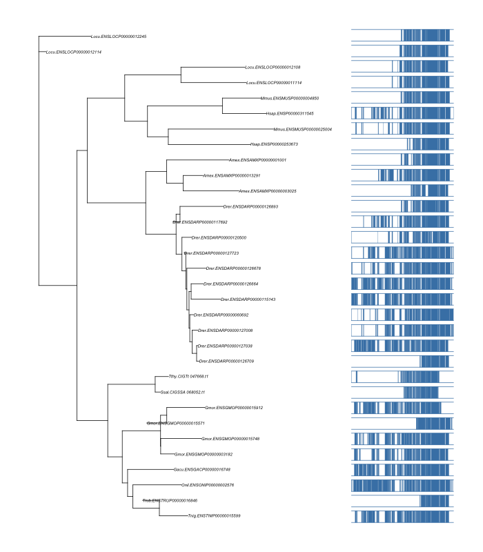

- [DEXSeq<sub>plot.R</sub>](#sec-1)
  - [example](#sec-1-1)
  - [TASKS](#sec-1-2)
    - [Color option for groups](#sec-1-2-1)
- [fancy<sub>tree</sub>](#sec-2)
- [DB<sub>schema.R</sub>](#sec-3)
- [GOfunctions.R](#sec-4)
- [GOfunctions2.R](#sec-5)
- [circos<sub>script.R</sub>](#sec-6)
- [circos<sub>script2.R</sub>](#sec-7)
- [grid<sub>heatmap.R</sub>](#sec-8)
- [grid<sub>matrix.R</sub>](#sec-9)
- [tile<sub>heatmap.R</sub>](#sec-10)

Collection of usefull `` `R` `` scripts; README has to be improved in time

# DONE DEXSeq<sub>plot.R</sub><a id="orgheadline4"></a>

Script providing extended functionality to plot `` `DEXSeq` `` results.

## example<a id="orgheadline1"></a>

```R
library(DEXSeq)
library(data.table)
source('~/Documents/R_scripts/R/DEXSeq_plot.R')
load( "~/Documents/Cigene/Side_Projects/Radioactive/data/de_exon.RData")

# read gff
gff <- fread('~/Documents/Cigene/Side_Projects/Radioactive/plot-test/Salmon_3p6_Chr_070715_All.filter.gff3', 
	     verbose = FALSE)

plot.DEX(dxr, geneID = 'CIGSSA_022765', fitExpToVar = 'group', 
	 gff = gff, geneNAME = 'tp53')
```


## TASKS<a id="orgheadline3"></a>

### TODO Color option for groups<a id="orgheadline2"></a>

# DONE fancy<sub>tree</sub><a id="orgheadline5"></a>

Script to show the alignments side by side with the tree. 

-   **Important** the \`plot.tb\` accepts accepts additional parameters for
    the \`plot.phylo\` function (passed on by \`&#x2026;\`).

```R
library(phangorn)
source('~/Documents/R_scripts/R/fancy_tree.R')

# read alignment
algn <- read.phyDat('data/grp101740_MAFFT.algn', type = 'AA', format = 'fasta')
dm = dist.ml(algn, model = 'WAG')
tree1 <- nj(dm)

# Strange; but necessary to get the correct order
tree1 <- read.tree(text = write.tree(ladderize(tree1)))
# root
tree1 <- root( tree1, outgroup = "Locu.ENSLOCP00000012114")

#grid.newpage()
plot.tb(tree1, algn, block.col = 'steelblue', block.lwd = 1)
```



# DONE DB<sub>schema.R</sub><a id="orgheadline6"></a>

Old script with some `` `grid` `` code to plot DB schemas

# GOfunctions.R<a id="orgheadline7"></a>

# GOfunctions2.R<a id="orgheadline8"></a>

# TODO circos<sub>script.R</sub><a id="orgheadline9"></a>

# TODO circos<sub>script2.R</sub><a id="orgheadline10"></a>

# grid<sub>heatmap.R</sub><a id="orgheadline11"></a>

# DONE grid<sub>matrix.R</sub><a id="orgheadline12"></a>

Plot overlap matrix 

# tile<sub>heatmap.R</sub><a id="orgheadline13"></a>
